# Visión de arquitectura Toures Balón

  - Andrea Gómez
  - Iván Linares
  - Iván Pinilla
  - Jennifer Goyeneche
  - Julio Pinzón
  - Manuel González

## Introducción 

A continuación, se presenta la visión de arquitectura que se ha definido
para Toures Balón, evaluando el problema, el proceso, los actores,
requerimientos, restricciones y las decisiones de arquitectura a la
solución propuesta, para lo anterior, se proveen varias vistas del
modelado, así como, una versión demo al proceso solicitado teniendo en
cuenta la información requerida desde diferentes perspectivas e
integraciones identificadas.

## Antecedentes 

Toures Balón es una agencia de viajes especializada en planes turísticos
donde el eje central son los espectáculos deportivos (especialmente el
fútbol), cuyo objetivo a largo plazo es posicionarse de modo que cuando
un colombiano quiera asistir a un evento deportivo encuentre aquí una
solución ágil, con precio justo y confiable. Es así como, en su modelo
de negocio, hacia los clientes, gestiona ordenes de servicio con
proveedores encargados del transporte, el alojamiento y los diferentes
eventos, de modo que se realice una reserva y pago de los servicios
contratados. A continuación, se visualiza el diagrama de vista de
Negocio de la organización

## Diagrama de visión del Negocio 

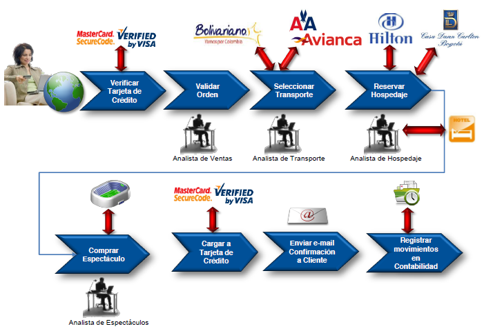

## Declaración de la visión de negocio

La visión de Toures Balón de lograr ser pionera en centralizar planes
turísticos en espectáculos deportivos, un posicionamiento y un respeto
en el mercado nacional y brindar a sus clientes soluciones ágiles, con
precio justo y confiable, mejorando así mismo la experiencia de compra.

## Problemas y escenarios por abordar

A continuación, se relacionan las solicitudes realizadas por Toures
Balón dentro del marco de sus necesidades del proceso de gestionar las
ordenes de servicio

  - El proceso debe ser medible y ajustable ágilmente

  - Analizar los niveles de automatización del proceso - Mejora y
    automatización de las actividades del proceso en su máxima extensión

  - Soporte de recolección de información de navegación de los usuarios
    y servidores para futuro análisis (Tagging)

  - Capacidad de respuesta de las funcionalidades del negocio para
    temporadas altas, siendo el sistema ser capaz de crecer y decrecer
    dinámicamente según la demanda como lo son eventos deportivos
    (Mundiales y Olímpicos), Black Friday, Cyber-Monday, navidad y otros
    en donde la demanda por los servicios puede crecer hasta 250% sobre
    la operación normal.

  - Capacidad de agregar nuevos proveedores/convenios/alianzas sin que
    sea traumático

  - Se espera que el sitio para Colombia atienda alrededor de 10
    millones de vistas mensuales.

  - Las peticiones de consulta de productos no deben tardar más de 1.5
    segundos promedio por usuario.

  - Ninguna petición puede tardar más de 3 segundos por usuario.

  - Soporte de canales de atención a través de la Web, dispositivos
    móviles y nuevas tecnologías

  - Soporte de operación del negocio 24x7x365, se espera disponibilidad
    del 99.999

  - Para la salida de los mercados de Perú, Chile, México (Segundo año
    de operación de la

  - plataforma), más la aplicación en la cobertura de operación local,
    se espera un crecimiento de 2.4x, es decir 24 millones de visitas
    mensuales. .

  - Implementar el mecanismo de subasta inversa para todos los
    proveedores

  - El 65% de todas las peticiones de los usuarios son sobre consultas
    al catálogo de productos que ofrece el sitio.

  - Hacer convenios tecnológicos con aerolíneas y hoteles

  - El servicio de pagos debe soportar pagos por VISA, MasterCard, AMEX,
    Discover y PayPal. Para el caso de Colombia se deben aceptar pagos
    por PSE adicionalmente a los mencionados.

  - Capacidad de cambiar condiciones o reglas de negocio sin tener que
    re-desplegar el sistema

  - Todo el tratamiento y procesamiento de la información de pagos debe
    cumplir con la norma PCI.

  - La aplicación en general debe estar libre de al menos el Top 10 de
    riesgos mencionados por OWASP, en su última edición.

  - Se espera que el sitio para Colombia atienda alrededor de 10
    millones de vistas mensuales.

  - El contenido digital (Imágenes, Videos Cortos, etc) juega un factor
    relevante en el sitio, en promedio este representa alrededor del 60%
    de lo que se despliega en la página, sin contar JS o Data-Driven
    Content, por lo que se requiere una solución que permita manejar
    este contenido, cachearlo y hacerlo disponible de manera cercana al
    usuario que lo solicita

## Motivadores y restricciones de negocio

  - Satisfacer en detalle todos los ideales turísticos y deportivos de
    los clientes, acompañados en el proceso del mejoramiento continuo y
    calidad de vida de quienes conforman el equipo de trabajo de
    TouresBalón.

  - Lograr un posicionamiento y un respeto en el mercado nacional como
    integrador de paquetes turísticos relacionados con el deporte a
    través del portafolio de servicio.

  - Participar en los mercados con nuestros productos competitivos, pero
    que sean beneficiosos para TouresBalón, para que genere crecimiento
    con Calidad de Servicio y Cumplimiento a nuestros clientes internos
    y externos.

  - Crear un portal de Internet que permita a los clientes de
    TouresBalón crear planes turísticos para asistir a los espectáculos
    deportivos que escoja. Este portal debe complementarse con un equipo
    logístico ágil y un proceso optimizado para que los clientes
    obtengan su plan lo más rápido posible.

  - A corto plazo lograr posicionarse como una empresa pionera en
    centralizar sus planes turísticos en espectáculos deportivos.

  - A largo plazo cuando un colombiano quiera asistir a un espectáculo
    deportivo, sabrá que con TouresBalón encontrará una solución ágil,
    con precio justo y confiable

  - Para tener una gestión más adecuada de los clientes, estos estarán
    tipificados al momento de validar las órdenes de compra.

## Propuesta de Arquitectura Base

A continuación, se relaciona la forma en la cual Archetype presenta la
solución a las necesidades expuestas por parte de Toures Balón; esta se
desarrollará, mediante la explicación identificación de los principios,
restricciones, los atributos de calidad, las decisiones de arquitectura
y el modelado de la misma; incluyendo los diagramas de proceso, capas,
datos y despliegue, así como la propuesta de desarrollo en la que se
indican, tiempo y costos aproximados para su puesta en funcionamiento.

## Principios 

**Principios Empresariales**

• Maximizar los beneficios para la Organización

• Cumplimiento de la Ley

• Orientación al servicio

• Continuidad del negocio

**Principios de datos**

**•** Datos como activo estratégico de la organización

• Seguridad de datos

• Compartir los datos

**Principios de aplicación**

**•** Usabilidad, como pilar fundamental en las aplicaciones

• Independencia tecnológica

• Eficiencia en el desempeño y mantenibilidad de las aplicaciones

**Principios tecnológicos**

**•** Cambios basados en requerimientos

• Gestión receptiva del cambio

• Comunicación entre sistemas o componentes

## Riesgos y Restricciones 

Los costos en la facturación pueden varias positiva o negativamente por
la moneda empleada (USD) e incrementarse de acuerdo con las temporadas
de alta demanda

El manejo de la una disponibilidad de 99.9999 genera unos costos muy
elevados razón por la cual se pone a consideración del negocio, y se
presenta las tablas de relación del nivel de servicio por año y por
componente

| **Nivel de disponibilidad** | **Tiempo sin servicio/año** |         |
| --------------------------- | --------------------------- | ------- |
| 90%                         | 36,5                        | Días    |
| 95%                         | 18,25                       | Días    |
| 99%                         | 3,65                        | Días    |
| 99,50%                      | 44                          | Horas   |
| 99,90%                      | 8,76                        | Horas   |
| 99,95%                      | 4,38                        | Horas   |
| 99,99%                      | 52,5                        | minutos |
| 99,999%                     | 5,3                         | minutos |

| **Componente**   | **Disponibilidad** |
| ---------------- | ------------------ |
| Web              | 85%                |
| Aplicación       | 90%                |
| Base de Datos    | 99,9%              |
| DNS              | 98,0%              |
| Firewall         | 85,0%              |
| Data center Nube | 99,999%            |

Se podrían adicionar o retirar proveedores y convenios según la
necesidad, pero para entregar a los clientes información rápidamente,
esta será almacenada previamente, así como parametrizado un tiempo de
vigencia para los valores de los productos

## Atributos de calidad

Para atender de forma correcta los problemas y escenarios a abordar, se
han relacionado a los atributos de calidad de la norma 25001, de modo
que las decisiones tomadas tengan sustento y validez, así como presentar
a Toures Balón una alineación de sus necesidades que puedan ser medidas.

| **Atributo de Calidad** | **Criterio**                                                                                                            | **Escenario** | **Descripción Escenario**                                                                                                                                                                                                                                             | **Imp.** | **Dif.** |
| ----------------------- | ----------------------------------------------------------------------------------------------------------------------- | ------------- | --------------------------------------------------------------------------------------------------------------------------------------------------------------------------------------------------------------------------------------------------------------------- | -------- | -------- |
| Adaptabilidad           | adaptado de forma efectiva y eficiente a diferentes entornos determinados de hardware, software, operacionales o de uso | AC001         | El sitio debe ser responsive, este requerimiento tiene prioridad sobre cualquier desarrollo de app móvil.                                                                                                                                                             | A        | M        |
|                         |                                                                                                                         |               |                                                                                                                                                                                                                                                                       |          |          |
| Adecuación Funcional    | Pertinencia funcional                                                                                                   | AC002         | Consultas al catálogo de productos que ofrece el sitio.                                                                                                                                                                                                               | A        | M        |
|                         |                                                                                                                         |               |                                                                                                                                                                                                                                                                       |          |          |
| Capacidad               | Cumplir con requisitos                                                                                                  | AC003         | Recolección de información de navegación de los usuarios y servidores para futuro análisis (Tagging).                                                                                                                                                                 | B        | M        |
|                         |                                                                                                                         | AC004         | Análisis de datos sobre el comportamiento de los visitantes del sitio para procesos de mejora de la experiencia de usuario y campañas comerciales.                                                                                                                    | M        | A        |
|                         |                                                                                                                         | AC005         | El sitio debe soportar Full-Text Search en la búsqueda de productos. Debe soportar resultados similares para nunca mostrar 0 resultados.                                                                                                                              | M        | M        |
|                         |                                                                                                                         |               |                                                                                                                                                                                                                                                                       |          |          |
| Compatibilidad          | Variada Multicanalidad                                                                                                  | AC006         | Soporte de canales de atención a través de la Web, dispositivos móviles y nuevas interfaces de interacción (smartwatches, Amazon Echo, Google Home, StartTVs, ...) e integración de procesos B2B.                                                                     | B        | M        |
|                         |                                                                                                                         |               |                                                                                                                                                                                                                                                                       |          |          |
| Disponibilidad          | Capacidad de respuesta en ciertas fechas                                                                                | AC007         | Capacidad de respuesta de las funcionalidades del negocio para temporadas altas como lo son eventos deportivos (Mundiales y Olímpicos), Black Friday, Cyber-Monday y navidad                                                                                          | A        | A        |
|                         |                                                                                                                         | AC008         | El sistema debe ser capaz de crecer y decrecer dinámicamente según la demanda. Este caso en especial se ve reflejado en las fechas como Cyber-Mondays, Black-Fridays y otros en donde la demanda por los servicios puede crecer hasta 250% sobre la operación normal. | A        | A        |
|                         | Estar operativo y accesible                                                                                             | AC009         | Para la salida de los mercados de Perú, Chile, México (Segundo año de operación de la plataforma), más la aplicación en la cobertura de operación local, se espera un crecimiento de 2.4x, es decir 24 millones de visitas mensuales.                                 | M        | A        |
|                         |                                                                                                                         | AC010         | Se espera que el sitio para Colombia atienda alrededor de 10 millones de vistas mensuales                                                                                                                                                                             | M        | M        |
|                         |                                                                                                                         |               |                                                                                                                                                                                                                                                                       |          |          |
| Eficiencia de desempeño | Comportamiento temporal                                                                                                 | AC011         | Las peticiones de consulta de productos no deben tardar más de 1.5 segundos promedio por usuario.                                                                                                                                                                     | A        | M        |
|                         |                                                                                                                         | AC012         | Ninguna petición puede tardar más de 3 segundos por usuario.                                                                                                                                                                                                          | A        | A        |
|                         |                                                                                                                         | AC013         | Comportamiento de recursos                                                                                                                                                                                                                                            | A        | A        |
|                         |                                                                                                                         |               |                                                                                                                                                                                                                                                                       |          |          |
| Interoperabilidad       | Estar operativo y accesible                                                                                             | AC014         | Soporte de operación del negocio 24x7x365, se espera disponibilidad del 99.999                                                                                                                                                                                        | A        | M        |
|                         | Intercambio de información                                                                                              | AC015         | Implementar el mecanismo de subasta inversa para todos los proveedores.                                                                                                                                                                                               | M        | A        |
|                         |                                                                                                                         | AC016         | El servicio de pagos debe soportar pagos por VISA, MasterCard, AMEX, Discover y PayPal. Para el caso de Colombia se deben aceptar pagos por PSE adicionalmente a los mencionados.                                                                                     | A        | M        |
|                         |                                                                                                                         |               |                                                                                                                                                                                                                                                                       |          |          |
| Modularidad             | Sistema Parametrizable                                                                                                  | AC017         | Capacidad de agregar nuevos proveedores/convenios/alianzas sin que sea traumático.                                                                                                                                                                                    | M        | M        |
|                         |                                                                                                                         | AC018         | Capacidad de cambiar condiciones o reglas de negocio sin tener que re-desplegar el sistema                                                                                                                                                                            | A        | M        |
|                         |                                                                                                                         |               |                                                                                                                                                                                                                                                                       |          |          |
| Usabilidad              | Capacidad para ser usado                                                                                                | AC019         | Se requiere una solución que permita manejar el contenido digital (Imágenes, Videos Cortos, etc), cachearlo y hacerlo disponible                                                                                                                                      | A        | M        |
|                         | Protección contra errores de usuario                                                                                    | AC020         | Mejora y automatización de las actividades del proceso en su máxima extensión.                                                                                                                                                                                        | A        | M        |
|                         |                                                                                                                         |               |                                                                                                                                                                                                                                                                       |          |          |
| Seguridad               | Autenticación                                                                                                           | AC021         | La aplicación en general debe estar libre del riesgo de Pérdida de autenticación mencionado en el top 10 de OWASP.                                                                                                                                                    | A        | M        |
|                         | Confidencialidad                                                                                                        | AC022         | Todo el tratamiento y procesamiento de la información de pagos debe cumplir con la norma PCI.                                                                                                                                                                         | A        | M        |
|                         | No repudio                                                                                                              | AC023         | La aplicación en general debe estar libre del riesgo de Pérdida de control de Acceso mencionado en el top 10 de OWASP.                                                                                                                                                | A        | M        |
|                         |                                                                                                                         | AC024         | La aplicación en general debe estar libre del riesgo de Configuración de seguridad incorrecta mencionado en el top 10 de OWASP.                                                                                                                                       | A        | A        |
|                         | Integridad                                                                                                              | AC025         | La aplicación en general debe estar libre del riesgo de Entidades externas XML (XXE) mencionado en el top 10 de OWASP.                                                                                                                                                | A        | M        |
|                         |                                                                                                                         | AC026         | La aplicación en general debe estar libre del riesgo de Inyección mencionado en el top 10 de OWASP.                                                                                                                                                                   | A        | M        |
|                         |                                                                                                                         | AC027         | La aplicación en general debe estar libre del riesgo de Secuencia de comandos en Sitios Cruzados (XSS) mencionado en el top 10 de OWASP.                                                                                                                              | A        | A        |
|                         |                                                                                                                         | AC028         | La aplicación en general debe estar libre del riesgo de Deserialización insegura mencionado en el top 10 de OWASP.                                                                                                                                                    | A        | A        |
|                         |                                                                                                                         | AC029         | La aplicación en general debe estar libre del riesgo de Componentes con vulnerabilidades conocidas mencionado en el top 10 de OWASP.                                                                                                                                  | A        | A        |
|                         | Responsabilidad                                                                                                         | AC030         | La aplicación en general debe estar libre del riesgo de Registro y monitoreo insuficientes mencionado en el top 10 de OWASP.                                                                                                                                          | A        | M        |

## Evaluación ATAM

| **Atributo de Calidad**     | **Adaptabilidad - adaptado de forma efectiva y eficiente a diferentes entornos determinados de hardware, software, operacionales o de uso** |
| --------------------------- | ------------------------------------------------------------------------------------------------------------------------------------------- |
| **Id Escenario**            | AC001 - El sitio debe ser responsive                                                                                                        |
| **Fuente**                  | Un usuario accediendo a la aplicación Toures Balon                                                                                          |
| **Artefacto**               | Aplicación de Toures Balón                                                                                                                  |
| **Ambiente**                | Ambiente normal de operación                                                                                                                |
| **Estímulo**                | Ingreso al portal                                                                                                                           |
| **Respuesta**               | Presentación de información de acuerdo con la resolución del dispositivo con el que se realiza el ingreso.                                  |
| **Decisión Arquitectonica** | La aplicación se implementa en HTML5 que nos permite visualizar el sitio web en varios tipos de dispositivos                                |
| **Medida de la respuesta**  | Se debe verificar que el ingreso al portal se muestre correctamente desde cualquier dispositivo.                                            |

| **Atributo de Calidad**     | **Adecuación Funcional - Pertinencia funcional**                                                         |
| --------------------------- | -------------------------------------------------------------------------------------------------------- |
| **Id Escenario**            | AC002 - Consultas al catálogo de productos que ofrece el sitio                                           |
| **Fuente**                  | Un usuario consultando los productos en la aplicación de Toures Balón                                    |
| **Artefacto**               | Aplicación de Toures Balón                                                                               |
| **Ambiente**                | Ambiente normal                                                                                          |
| **Estímulo**                | Consulta de productos                                                                                    |
| **Respuesta**               | Resultado de productos                                                                                   |
| **Decisión arquitectónica** | Microservicio de consulta de productos, Implementar Aurora Serverless para la base de datos de Productos |
| **Medida de la respuesta**  | Medir el performance de la consulta                                                                      |

| **Atributo de Calidad**     | **Capacidad- Cumplir con requisitos**                                                                                                                                                                    |
| --------------------------- | -------------------------------------------------------------------------------------------------------------------------------------------------------------------------------------------------------- |
| **Id Escenario**            | AC003 - Recolección de información de navegación de los usuarios y servidores                                                                                                                            |
| **Fuente**                  | Un usuario navegando en la aplicación de Toures Balón                                                                                                                                                    |
| **Artefacto**               | Aplicación de Toures Balón                                                                                                                                                                               |
| **Ambiente**                | Ambiente normal de operación                                                                                                                                                                             |
| **Estímulo**                | Consulta de productos                                                                                                                                                                                    |
| **Respuesta**               | Resultado de productos                                                                                                                                                                                   |
| **Decisión arquitectónica** | Google Analytics para conocer mejor a los usuarios de la aplicación de Toures balón para comprobar mejor el rendimiento de sus acciones de marketing, su contenido y sus productos, entre otros aspectos |
| **Medida de la respuesta**  | Se deben recolectar la información de los usuarios mediante Google Analytics                                                                                                                             |

| **Atributo de Calidad**     | **Capacidad- Cumplir con requisitos**                                                                                                                                                                    |
| --------------------------- | -------------------------------------------------------------------------------------------------------------------------------------------------------------------------------------------------------- |
| **Id Escenario**            | AC004 - Análisis de datos sobre el comportamiento de los visitantes del sitio                                                                                                                            |
| **Fuente**                  | Un usuario navegando en la aplicación de Toures Balón                                                                                                                                                    |
| **Artefacto**               | Aplicación de Toures Balón                                                                                                                                                                               |
| **Ambiente**                | Ambiente normal de operación                                                                                                                                                                             |
| **Estímulo**                | Consulta de productos                                                                                                                                                                                    |
| **Respuesta**               | Resultado de productos                                                                                                                                                                                   |
| **Decisión arquitectónica** | Google Analytics para conocer mejor a los usuarios de la aplicación de Toures balón para comprobar mejor el rendimiento de sus acciones de marketing, su contenido y sus productos, entre otros aspectos |
| **Medida de la respuesta**  | Se deben recolectar la información de los usuarios mediante Google Analytics                                                                                                                             |

| **Atributo de Calidad**     | **Capacidad- Cumplir con requisitos**                                                                            |
| --------------------------- | ---------------------------------------------------------------------------------------------------------------- |
| **Id Escenario**            | AC005 - El sitio debe soportar Full-Text Search                                                                  |
| **Fuente**                  | Un usuario realizando la búsqueda de productos                                                                   |
| **Artefacto**               | Aplicación de Toures Balón                                                                                       |
| **Ambiente**                | Ambiente normal de operación                                                                                     |
| **Estímulo**                | Búsqueda de productos                                                                                            |
| **Respuesta**               | Respuesta de productos, nunca debe ser cero                                                                      |
| **Decisión arquitectónica** | En el componente (microservicio) de productos implementar las consultas full-text mediante análisis morfologico. |
| **Medida de la respuesta**  | Se debe verificar que cualquier consulta en la aplicación nuca sea cero.                                         |

| **Atributo de Calidad**    | **Compatibilidad- Variada Multicanalidad**                                                                                                                                    |
| -------------------------- | ----------------------------------------------------------------------------------------------------------------------------------------------------------------------------- |
| **Id Escenario**           | AC006 - Soporte de canales de atención a través de la Web                                                                                                                     |
| **Fuente**                 | Usuario                                                                                                                                                                       |
| **Artefacto**              | Aplicación de Toures Balón                                                                                                                                                    |
| **Ambiente**               | Ambiente normal                                                                                                                                                               |
| **Estímulo**               | Consultas a través de la Web, dispositivos móviles y nuevas interfaces de interacción (smartwatches, Amazon Echo, Google Home, StartTVs, ...)                                 |
| **Respuesta**              | Resultado de consultas                                                                                                                                                        |
| **Medida de la respuesta** | Se debe verificar el resultado de las consultas desde la Web, dispositivos móviles y nuevas interfaces de interacción (smartwatches, Amazon Echo, Google Home, StartTVs, ...) |

| **Atributo de Calidad**     | **Disponibilidad- Capacidad de respuesta en ciertas fechas**                                                                                                                                                         |
| --------------------------- | -------------------------------------------------------------------------------------------------------------------------------------------------------------------------------------------------------------------- |
| **Id Escenario**            | AC007 - Capacidad de respuesta de las funcionalidades del negocio para temporadas altas                                                                                                                              |
| **Fuente**                  | Usuarios                                                                                                                                                                                                             |
| **Artefacto**               | Aplicación de Toures balón                                                                                                                                                                                           |
| **Ambiente**                | Condiciones de carga                                                                                                                                                                                                 |
| **Estímulo**                | Múltiples usuarios accediendo a la aplicación de toures balón para realizar transacciones de compra en temporadas altas como lo son eventos deportivos (Mundiales y Olímpicos), Black Friday, Cyber-Monday y navidad |
| **Respuesta**               | Respuesta de las consultas a la aplicación                                                                                                                                                                           |
| **Decisión arquitectónica** | Implementar Aurora Serverless para la base de datos de la aplicación de Toures Balón y microservicios autoescalables desplegados en el motor Fargate                                                                 |
| **Medida de la respuesta**  | Se debe monitorear que la aplicación responda en condiciones de carga                                                                                                                                                |

<table>
<thead>
<tr class="header">
<th><strong>Atributo de Calidad</strong></th>
<th><strong>Disponibilidad- Capacidad de respuesta en ciertas fechas</strong></th>
</tr>
</thead>
<tbody>
<tr class="odd">
<td><strong>Id Escenario</strong></td>
<td>AC008 - El sistema debe ser capaz de crecer y decrecer dinámicamente según la demanda</td>
</tr>
<tr class="even">
<td><strong>Fuente</strong></td>
<td>Usuarios realizando transacciones en la aplicación de Toures Balón en las fechas como Cyber-Mondays, Black-Fridays y otros en donde la demanda por los servicios puede crecer hasta 250% sobre la operación normal</td>
</tr>
<tr class="odd">
<td><strong>Artefacto</strong></td>
<td>Aplicación Toures balón</td>
</tr>
<tr class="even">
<td><strong>Ambiente</strong></td>
<td>Ambiente normal</td>
</tr>
<tr class="odd">
<td><strong>Estímulo</strong></td>
<td>Solicitud de peticiones</td>
</tr>
<tr class="even">
<td><strong>Respuesta</strong></td>
<td>Escalamiento de acuerdo a las peticiones realizadas</td>
</tr>
<tr class="odd">
<td><strong>Decisión arquitectónica</strong></td>
<td>
Implementar AWS Fargate con

Autoescalamiento
</td>
</tr>
<tr class="even">
<td><strong>Medida de la respuesta</strong></td>
<td>Se debe monitoreas que sin la necesidad de aprovisionar servidores los microservicios sean autoescalables</td>
</tr>
</tbody>
</table>

| **Atributo de Calidad**    | **Disponibilidad - Estar operativo y accesible**                       |
| -------------------------- | ---------------------------------------------------------------------- |
| **Id Escenario**           | AC009 - Crecimiento de 2.4x, es decir 24 millones de visitas mensuales |
| **Fuente**                 | Visitas mensuales a la página de Toures Balón                          |
| **Artefacto**              | Aplicación Toures Balon                                                |
| **Ambiente**               | Ambiente normal de operación                                           |
| **Estímulo**               | Visita del usuario                                                     |
| **Respuesta**              | Resultados estadísticos de la herramienta CloudWatch                   |
| **Medida de la respuesta** | Implementar AWS Fargate con auto escalamiento                          |
|                            | Se debe medir número de visitas mensuales                              |

| **Atributo de Calidad**     | **Disponibilidad - Estar operativo y accesible**              |
| --------------------------- | ------------------------------------------------------------- |
| **Id Escenario**            | AC010 - Atención alrededor de 10 millones de vistas mensuales |
| **Fuente**                  | Visitas mensuales a la página de Toures Balón                 |
| **Artefacto**               | Aplicación Toures Balon                                       |
| **Ambiente**                | Ambiente normal de operación                                  |
| **Estímulo**                | Visita del usuario                                            |
| **Respuesta**               | Resultados estadísticos de la herramienta CloudWatch          |
| **Decisión Arquitectónica** | Implementar AWS Fargate con auto escalamiento                 |
| **Medida de la respuesta**  | Se debe medir número de visitas mensuales                     |

| **Atributo de Calidad**     | **Eficiencia de desempeño - Comportamiento temporal**                                                                    |
| --------------------------- | ------------------------------------------------------------------------------------------------------------------------ |
| **Escenario**               | AC011 - Las peticiones de consulta de productos no deben tardar más de 1.5 segundos promedio por usuario.                |
| **Fuente**                  | Cliente consultando productos en la aplicación                                                                           |
| **Artefacto**               | Componente (microservicio) Productos                                                                                     |
| **Ambiente**                | Ambiente normal de operación                                                                                             |
| **Estímulo**                | Consulta de productos                                                                                                    |
| **Respuesta**               | Resultado de productos en menos de 1.5 segundos                                                                          |
| **Decisión Arquitectonica** | Implementación de Aurora Serverless para la base de datos de productos, donde se aumenta el rendimiento                  |
| **Medida de la respuesta**  | Se debe medir que la consulta de los productos desde la aplicación no tarde más de 1.5 segundos en promedio por usuario. |

| **Atributo de Calidad**     | **Eficiencia de desempeño - Comportamiento temporal**                       |
| --------------------------- | --------------------------------------------------------------------------- |
| **Id Escenario**            | AC012 - Ninguna petición puede tardar más de 3 segundos por usuario         |
| **Fuente**                  | Cliente haciendo transacciones en la aplicación                             |
| **Artefacto**               | Aplicación Toures Balon                                                     |
| **Ambiente**                | Ambiente normal de operación                                                |
| **Estímulo**                | Solicitud de petición por usuario                                           |
| **Respuesta**               | Respuesta en menos de 3 segundos                                            |
| **Decisión Arquitectónica** | Implementación de microservicios                                            |
| **Medida de la respuesta**  | Se debe medir que la petición no puede tardar más de 3 segundos por usuario |

| **Atributo de Calidad**    | **Eficiencia - Comportamiento de recursos**                                                        |
| -------------------------- | -------------------------------------------------------------------------------------------------- |
| **Id Escenario**           | AC013 - Comportamiento de recursos                                                                 |
| **Fuente**                 | Cliente dueño de la Orden                                                                          |
| **Artefacto**              | Componentes involucrados para la generación de la orden                                            |
| **Ambiente**               | Condiciones de carga                                                                               |
| **Estímulo**               | El cliente realiza una orden de compra                                                             |
| **Respuesta**              | Resultados estadísticos de la herramienta CloudWatch.                                              |
| **Medida de la respuesta** | Se debe medir recursos de máquina, este proceso no debe superar el 20% de uso de memoria, cpu, dd. |

| **Atributo de Calidad**     | **Interoperabilidad- Estar operativo y accesible**                                     |
| --------------------------- | -------------------------------------------------------------------------------------- |
| **Id Escenario**            | AC014 - Soporte de operación del negocio 24x7x365, se espera disponibilidad del 99.999 |
| **Fuente**                  | Usuario realizando transacciones desde la aplicación de Toures Balon                   |
| **Artefacto**               | Aplicación Toures Balón                                                                |
| **Ambiente**                | Ambiente normal de operación                                                           |
| **Estímulo**                | Solicitudes del usuario                                                                |
| **Respuesta**               | Respuesta de acuerdo con la solicitud                                                  |
| **Decisión arquitectónica** | Implementar AWS Fargate y Aurora Serverless con configuración de multizona.            |
| **Medida de la respuesta**  | Se debe verificar la disponibilidad de la aplicación 24x7x365                          |

| **Atributo de Calidad**    | **Interoperabilidad - Intercambio de información**                                                                                                   |
| -------------------------- | ---------------------------------------------------------------------------------------------------------------------------------------------------- |
| **Id Escenario**           | AC015 - Implementar el mecanismo de subasta inversa para todos los proveedores                                                                       |
| **Fuente**                 | Usuario consultando productos del catalogo                                                                                                           |
| **Artefacto**              | Componente (Microservicio) Convenios                                                                                                                 |
| **Ambiente**               | Ambiente normal de operación                                                                                                                         |
| **Estímulo**               | Consulta de productos a los proveedores                                                                                                              |
| **Respuesta**              | Resultado de los productos por proveedor.                                                                                                            |
| **Medida de la respuesta** | Se debe verificar el resultado de los productos por proveedor ordenados desde el precio mas bajo y que le deje la mayor rentabilidad a Toures Balón. |

| **Atributo de Calidad**    | **Interoperabilidad - Intercambio de información**                                                   |
| -------------------------- | ---------------------------------------------------------------------------------------------------- |
| **Id Escenario**           | AC016 - El servicio de pagos debe soportar pagos por VISA, MasterCard, AMEX, Discover y PayPal       |
| **Fuente**                 | Usuario                                                                                              |
| **Artefacto**              | Componente (microservicio) ordenes                                                                   |
| **Ambiente**               | Ambiente normal de operación                                                                         |
| **Estímulo**               | Un usuario realizando pagos de productos desde la aplicación de Toures balón                         |
| **Respuesta**              | Pago realizado con éxito                                                                             |
| **Medida de la respuesta** | Se debe verificar que se puedan hacer compras con tarjetas VISA, MasterCard, AMEX, Discover y PayPal |

| **Atributo de Calidad**    | **Modularidad - Sistema Parametrizable**                                                                                       |
| -------------------------- | ------------------------------------------------------------------------------------------------------------------------------ |
| **Id Escenario**           | AC017 - Capacidad de agregar nuevos proveedores                                                                                |
| **Fuente**                 | Administrador de convenios                                                                                                     |
| **Artefacto**              | Componente (microservicio) Convenios                                                                                           |
| **Ambiente**               | Ambiente normal de operación                                                                                                   |
| **Estímulo**               | Agregación de proveedores insertándolo como un nuevo registro en la base de datos de proveedores.                              |
| **Respuesta**              | Proveedor agregado con éxito                                                                                                   |
| **Medida de la respuesta** | Se debe verificar que la aplicación tiene la capacidad de agregar nuevos proveedores/convenios/alianzas sin que sea traumático |

| **Atributo de Calidad**     | **Modularidad - Sistema Parametrizable**                                                                        |
| --------------------------- | --------------------------------------------------------------------------------------------------------------- |
| **Id Escenario**            | AC018 - Capacidad de cambiar condiciones o reglas de negocio sin tener que re-desplegar el sistema              |
| **Fuente**                  | Cambio de las condiciones en el motor de reglas sobre categorización de clientes                                |
| **Artefacto**               | Componente (microservicio) Clientes                                                                             |
| **Ambiente**                | Ambiente normal de operación                                                                                    |
| **Estímulo**                | Cambio de reglas de negocio                                                                                     |
| **Respuesta**               | Adaptación a nuevas reglas de negocio sin solicitar re-despliegue                                               |
| **Decisión arquitectónica** | Motor de reglas de negocio que expone un servicio rest y que consume el componente (microservicio) de clientes. |
| **Medida de la respuesta**  | Versionamiento de las reglas a nivel de motor de reglas y la aplicación no debe verse afectada.                 |

| **Atributo de Calidad**     | **Desempeño – Comportamiento en el tiempo**                                                                                                                                                                                                        |
| --------------------------- | -------------------------------------------------------------------------------------------------------------------------------------------------------------------------------------------------------------------------------------------------- |
| **Id Escenario**            | AC019 - Se requiere una solución que permita manejar el contenido digital (Imágenes, Videos Cortos, etc), cachearlo y hacerlo disponible                                                                                                           |
| **Fuente**                  | Usuario navegando en la página de Toures Balon                                                                                                                                                                                                     |
| **Artefacto**               | Aplicación Toures Balon                                                                                                                                                                                                                            |
| **Ambiente**                | Ambiente normal de operación                                                                                                                                                                                                                       |
| **Estímulo**                | Consulta de contenido digital                                                                                                                                                                                                                      |
| **Respuesta**               | Presentar contenido digital y cachear                                                                                                                                                                                                              |
| **Decisión Arquitectónica** | Cloudflare, donde se tienen copias locales de los contenidos de los clientes en servidores ubicados en diferentes zonas geográficas. Cuando un usuario quiere ver el sitio web, el servidor físicamente mas cercano le facilita todo el contenido. |
| **Medida de la respuesta**  | Medir que al requerir actualizaciones en la página se debe volver a cargar la información                                                                                                                                                          |

| **Atributo de Calidad**    | **Usabilidad - Protección contra errores de usuario**                                                                           |
| -------------------------- | ------------------------------------------------------------------------------------------------------------------------------- |
| **Id Escenario**           | AC020 - Mejora y automatización de las actividades del proceso                                                                  |
| **Fuente**                 | Usuario                                                                                                                         |
| **Artefacto**              | Componente (microservicio) Ordenes                                                                                              |
| **Ambiente**               | Ambiente normal de operación                                                                                                    |
| **Estímulo**               | Creación de un orden                                                                                                            |
| **Respuesta**              | El flujo de creación de ordenes se ejecuta completamente                                                                        |
| **Medida de la respuesta** | Se debe verificar que el proceso de creación de ordenes haya terminado y verificar que los tiempos sean óptimos al proceso TOBE |

| **Atributo de Calidad**     | **Seguridad - Autenticación**                                                                                                                                                                                            |
| --------------------------- | ------------------------------------------------------------------------------------------------------------------------------------------------------------------------------------------------------------------------ |
| **Id Escenario**            | AC021 - La aplicación en general debe estar libre del riesgo de Pérdida de autenticación                                                                                                                                 |
| **Fuente**                  | Un usuario autenticándose en la aplicación de Toures Balón                                                                                                                                                               |
| **Artefacto**               | Aplicación                                                                                                                                                                                                               |
| **Ambiente**                | Ambiente normal de operación                                                                                                                                                                                             |
| **Estímulo**                | Solicitud de los usuarios                                                                                                                                                                                                |
| **Respuesta**               | Respuestas de la aplicación de acuerdo con la solicitud de autenticación                                                                                                                                                 |
| **Decisión Arquitectónica** | Usar AWS Cognito para la administración de sesiones y usuarios donde podemos implementar varias formas de autenticar al cliente, donde podemos usar varios proveedores de identidad públicos Amazon, Facebook Twitter... |
| **Medida de la respuesta**  | Se debe medir el detalle de autenticaciones exitosas                                                                                                                                                                     |

| **Atributo de Calidad**     | **Seguridad – Confidencialidad**                                                                     |
| --------------------------- | ---------------------------------------------------------------------------------------------------- |
| **Id Escenario**            | AC022 - Todo el tratamiento y procesamiento de la información de pagos debe cumplir con la norma PCI |
| **Fuente**                  | Cliente realizando un pago en la aplicación de Toures Balon                                          |
| **Artefacto**               | Componente (microservicio) de ordenes                                                                |
| **Ambiente**                | Ambiente normal de operación                                                                         |
| **Estímulo**                | Solicitud de pago por parte del usuario                                                              |
| **Respuesta**               | Realización del pago                                                                                 |
| **Decisión Arquitectónica** | El tratamiento y procesamiento de la información se delega a un tercero con el convenio ACH          |
| **Medida de la respuesta**  | Verificar que los mensajes que se envíen hacia ACH estén cifrados.                                   |

| **Atributo de Calidad**      | **Seguridad - No repudio**                                                                                                                                                                                               |
| ---------------------------- | ------------------------------------------------------------------------------------------------------------------------------------------------------------------------------------------------------------------------ |
| **Id Escenario**             | AC023 - La aplicación en general debe estar libre del riesgo de Pérdida de control de Acceso                                                                                                                             |
| **Fuente**                   | Un usuario autenticándose en la aplicación de Toures Balón                                                                                                                                                               |
| **Artefacto**                | Aplicación                                                                                                                                                                                                               |
| **Ambiente**                 | Ambiente normal de operación                                                                                                                                                                                             |
| **Estímulo**                 | Solicitud de los usuarios                                                                                                                                                                                                |
| **Respuesta**                | Respuestas de la aplicación de acuerdo con la solicitud de autenticación                                                                                                                                                 |
| **Decisión arquitectónica ** | Usar AWS Cognito para la administración de sesiones y usuarios donde podemos implementar varias formas de autenticar al cliente, donde podemos usar varios proveedores de identidad públicos Amazon, Facebook Twitter... |
| **Medida de la respuesta**   | Se debe medir el detalle de autenticaciones exitosas                                                                                                                                                                     |

| **Atributo de Calidad**     | **Seguridad - No repudio**                                                                            |
| --------------------------- | ----------------------------------------------------------------------------------------------------- |
| **Id Escenario**            | AC024 - La aplicación en general debe estar libre del riesgo de Configuración de seguridad incorrecta |
| **Fuente**                  | Un usuario accediendo en la aplicación de Toures Balón                                                |
| **Artefacto**               | Aplicación de Toures Balón                                                                            |
| **Ambiente**                | Ambiente normal de operación                                                                          |
| **Estímulo**                | Solicitud de los usuarios                                                                             |
| **Respuesta**               | Respuestas de la aplicación de acuerdo con la solicitud                                               |
| **Decisión arquitectónica** | Usar AWS WAF configurándole el top 10 de OWASP                                                        |
| **Medida de la respuesta**  | Se debe verificar la configuración del WAF mediante una herramienta de monitoreo                      |

| **Atributo de Calidad**     | **Seguridad - Integridad**                                                                   |
| --------------------------- | -------------------------------------------------------------------------------------------- |
| **Id Escenario**            | AC025 - La aplicación en general debe estar libre del riesgo de Entidades externas XML (XXE) |
| **Fuente**                  | Un usuario accediendo en la aplicación de Toures Balón                                       |
| **Artefacto**               | Aplicación de Toures Balón                                                                   |
| **Ambiente**                | Ambiente normal de operación                                                                 |
| **Estímulo**                | Solicitud de los usuarios                                                                    |
| **Respuesta**               | Respuestas de la aplicación de acuerdo con la solicitud                                      |
| **Decisión arquitectónica** | Usar AWS WAF configurándole el top 10 de OWASP                                               |
| **Medida de la respuesta**  | Se debe verificar la configuración del WAF mediante una herramienta de monitoreo             |

| **Atributo de Calidad**     | **Seguridad - Integridad**                                                |
| --------------------------- | ------------------------------------------------------------------------- |
| **Id Escenario**            | AC026 - La aplicación en general debe estar libre del riesgo de Inyección |
| **Fuente**                  | Un usuario accediendo en la aplicación de Toures Balón                    |
| **Artefacto**               | Aplicación de Toures Balón                                                |
| **Ambiente**                | Ambiente normal de operación                                              |
| **Estímulo**                | Solicitud de los usuarios                                                 |
| **Respuesta**               | Respuestas de la aplicación de acuerdo con la solicitud                   |
| **Decisión arquitectónica** | Usar AWS WAF configurándole el top 10 de OWASP                            |

| **Atributo de Calidad**     | **Seguridad - Integridad**                                                                                     |
| --------------------------- | -------------------------------------------------------------------------------------------------------------- |
| **Id Escenario**            | AC027 - La aplicación en general debe estar libre del riesgo de Secuencia de comandos en Sitios Cruzados (XSS) |
| **Fuente**                  | Un usuario accediendo en la aplicación de Toures Balón                                                         |
| **Artefacto**               | Aplicación de Toures Balón                                                                                     |
| **Ambiente**                | Ambiente normal de operación                                                                                   |
| **Estímulo**                | Solicitud de los usuarios                                                                                      |
| **Respuesta**               | Respuestas de la aplicación de acuerdo con la solicitud                                                        |
| **Decisión arquitectónica** | Usar AWS WAF configurándole el top 10 de OWASP                                                                 |

| **Atributo de Calidad**     | **Seguridad - Integridad**                                                               |
| --------------------------- | ---------------------------------------------------------------------------------------- |
| **Id Escenario**            | AC028 - La aplicación en general debe estar libre del riesgo de Deserialización insegura |
| **Fuente**                  | Un usuario accediendo en la aplicación de Toures Balón                                   |
| **Artefacto**               | Aplicación de Toures Balón                                                               |
| **Ambiente**                | Ambiente normal de operación                                                             |
| **Estímulo**                | Solicitud de los usuarios                                                                |
| **Respuesta**               | Respuestas de la aplicación de acuerdo con la solicitud                                  |
| **Decisión arquitectónica** | Usar AWS WAF configurándole el top 10 de OWASP                                           |

| **Atributo de Calidad**     | **Seguridad - Integridad**                                                                                 |
| --------------------------- | ---------------------------------------------------------------------------------------------------------- |
| **Id Escenario**            | AC029 - La aplicación en general debe estar libre del riesgo de Componentes con vulnerabilidades conocidas |
| **Fuente**                  | Un usuario accediendo en la aplicación de Toures Balón                                                     |
| **Artefacto**               | Aplicación de Toures Balón                                                                                 |
| **Ambiente**                | Ambiente normal de operación                                                                               |
| **Estímulo**                | Solicitud de los usuarios                                                                                  |
| **Respuesta**               | Respuestas de la aplicación de acuerdo con la solicitud                                                    |
| **Decisión arquitectónica** | Usar AWS WAF configurándole el top 10 de OWASP                                                             |

| **Atributo de Calidad**    | **Seguridad - Responsabilidad**                                                                    |
| -------------------------- | -------------------------------------------------------------------------------------------------- |
| **Id Escenario**           | AC030 - La aplicación en general debe estar libre del riesgo de Registro y monitoreo insuficientes |
| **Fuente**                 | Un usuario accediendo en la aplicación de Toures Balón                                             |
| **Artefacto**              | Aplicación de Toures Balon                                                                         |
| **Ambiente**               | Ambiente normal de operación                                                                       |
| **Estímulo**               | Solicitud de los usuarios                                                                          |
| **Respuesta**              | Respuestas de la aplicación de acuerdo con la peticiones a la aplicación                           |
| **Medida de la respuesta** | Usar CloudWatch para el monitoreo y observabilidad                                                 |

# Modelado de Arquitectura

## Diagrama proceso de negocio gestionar orden

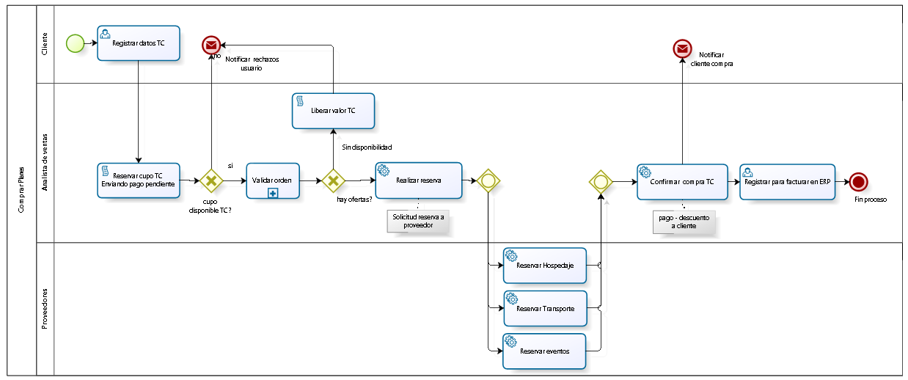

## Diagrama proceso propuesto gestionar producto

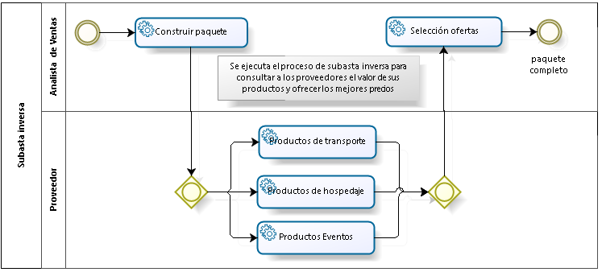

## Diagrama de capas 

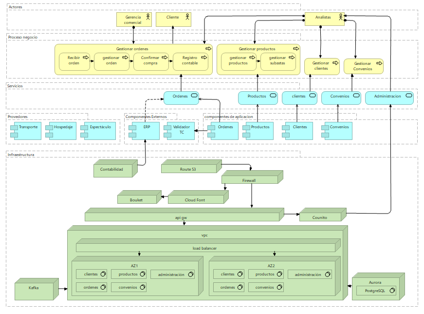

## Diagrama de datos

### Diagrama de clientes

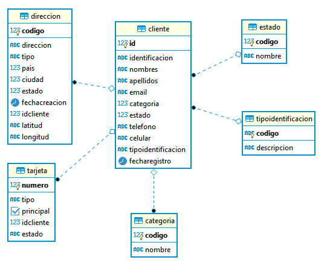

### Diagrama de convenios

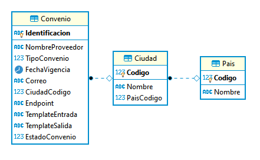

### Diagrama de ordenes

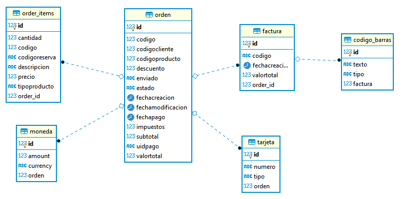

### Diagrama de productos

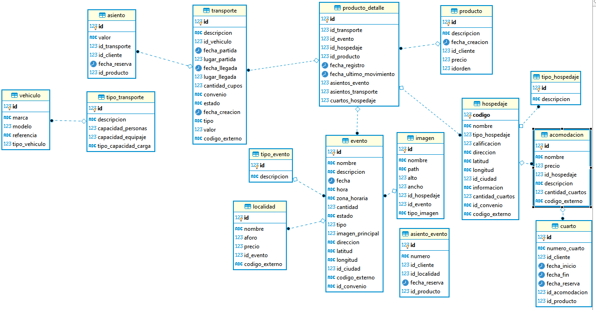

## Diagrama de despliegue

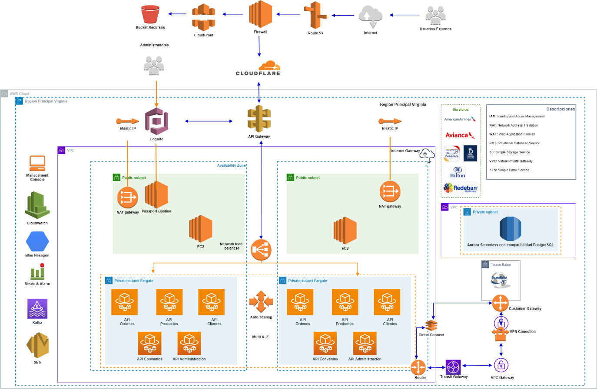

## Diagrama de despliegue de los servicios (convenios)

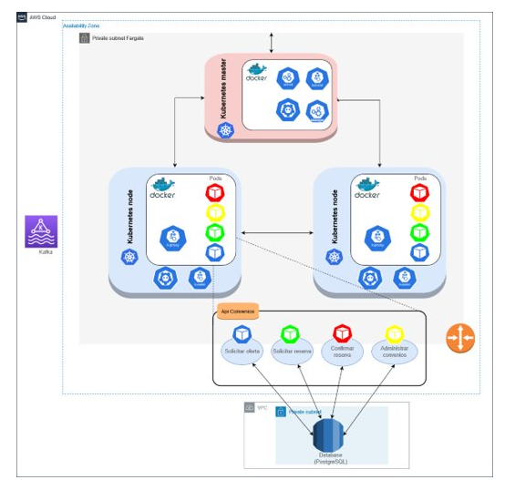

## Tecnologías empleadas

El esquema global de cada uno de los módulos se basará en la
arquitectura representada en la gráfica anterior:

Partimos del servicio Route S3 que se encargara de gestionar las
peticiones realizadas por los clientes invocando de acuerdo con la
solicitud el servicio asociado

Cognito para validación de credenciales y autenticación.

Cloudfront para el contenido estático, que a su vez almacenara el front
de la plataforma desarrollado en React y html5, estos podrán consumir
servicios y realizará peticiones al API Gateway para ser direccionados o
servicios de FARGATE.

Los servicios que impliquen el registro de data utilizarán Aurora para
el almacenamiento de la información este es un servicio de base de datos
RDS nativo.

Esta es la arquitectura base para cada una de las funcionalidades
generales, sin embargo, al contar con el entorno aws se utilizarán
servicios asociados para garantizar estabilidad, monitoreo y escabilidad
a la plataforma:

  - Cloudwatch: Servicio de Monitoreo y observación

  - SES: Servicio serverless para notificaciones via correo electrónico

  - AWS WAF: AWS WAF es un firewall para aplicaciones web que ayuda a
    proteger sus aplicaciones web o API contra ataques web comunes que
    pueden afectar la disponibilidad, poner en riesgo la seguridad o
    consumir demasiados recursos.

  - CloudFlare: Conjuntos de servidores ubicados en diferentes zonas
    geográficas que contienen copias locales de los contenidos de los
    clientes, con el fin de que el servidor más cercano responda más
    rápido con sus entregas

  - Fargate: Motor donde será desplegados los microservicios detallados
    en el catálogo de servicios

  - Apache Kafka: es una plataforma distribuida de transmisión de datos
    que permite publicar, almacenar y procesar flujos de registros y
    suscribirse a ellos en tiempo real. Opera siguiendo el patrón
    Publisher Surcriber, en el cual, los producers envían un mensaje
    asociado a un tópico, al cual se pueden suscribir 1 a n consumers.
    Kafka maneja los mensajes de forma ágil y escalable,
    transmitiéndolos a los consumidores de acuerdo con la configuración
    establecida. En otras palabras, Apache Kafka, permite manejar flujos
    de datos de varias fuentes y distribuirlos a diversos clientes,
    permitiendo integración de servicios de forma asíncrona de acuerdo
    con las necesidades de la arquitectura

  - BlueExagon: lue Hexagon como motor de análisis y protección contra
    amenazas, el cual nos ofrece un alto nivel de performance,
    disminuyendo los niveles de afectación sobre los sistemas integrados
    a este.

  - Catálogo de aplicaciones:

| **Nombre aplicación** | **Dominio** | **Lenguaje** | **Framework** |
| --------------------- | ----------- | ------------ | ------------- |
| Adminordenes          | Ordenes     | Java         | Quarkus       |
| Readordenes           | Ordenes     | Java         | Quarkus       |
| AdminProductos        | Productos   | Java         | Quarkus       |
| AdminConvenios        | Convenios   | C\#          | .Net Core 3.0 |
| ReservaConvenios      | Convenios   | Java         | Quarkus       |
| ClientesAPI           | Clientes    | Java         | SpringBoot    |

 

## Catálogo de Servicios

| **Dominio** | **Subdominio** | **Servicio**                | **Descripción**                                                                                                                                                                                                                                                                 | **Canal**  |
| ----------- | -------------- | --------------------------- | ------------------------------------------------------------------------------------------------------------------------------------------------------------------------------------------------------------------------------------------------------------------------------- | ---------- |
| Clientes    |                | Registrar Clientes          | Registro del cliente                                                                                                                                                                                                                                                            | Web, Movil |
| Clientes    |                | Actualizar Clientes         | Actualizacion de datos y estado de clientes                                                                                                                                                                                                                                     | Web, Movil |
| Clientes    |                | Consultar Clientes          | Consulta de clientes por los diferentes parametros                                                                                                                                                                                                                              | Web, Movil |
| Ordenes     |                | Crear ordenes               | Crear ordenes de productos                                                                                                                                                                                                                                                      | Web, Movil |
| Órdenes     |                | Cancelación de Órdenes      | El sistema permitirá la cancelación de órdenes de pedido en validación o en reservación que maneja TouresBalón.                                                                                                                                                                 | Web, Movil |
| Órdenes     |                | Consultar Ordenes           | Consultar ordenes por sus diferentes parametros                                                                                                                                                                                                                                 | Web, Movil |
| Órdenes     |                | Pagar orden                 | Servicio de pago de ordenes                                                                                                                                                                                                                                                     | Web, Movil |
| Órdenes     |                | Aprobar orden               | Servicio para aprobar ordenes que quedaron e estado pendiente de aprobar                                                                                                                                                                                                        | Web, Movil |
| Órdenes     | Factura        | Consultar factura           | Servicio de consulta de factura de una orden                                                                                                                                                                                                                                    | Web, Movil |
| Productos   |                | Administración de Productos | El sistema permitirá la creación, modificación y eliminación de los productos que comercializa TouresBalón. (Incluye la administración de imágenes). También el sistema permitirá la creación (*), modificación (*) y eliminación (\*) de las tarifas asociadas a los productos | Web, Movil |
| Productos   | Paquetes       | Administrar Paquetes        | El sistema permitirá creación (*), modificación (*) y eliminación (\*) de paquetes. Un paquete es un conjunto de eventos, con transportes y hospedajes                                                                                                                          | Web, Movil |
| Productos   | Transportes    | Administrar Transportes     | El sistema permitirá creación (*), modificación (*) y eliminación (\*) de paquetes. Un paquete es un conjunto de eventos, con transportes y hospedajes                                                                                                                          | Web, Movil |
| Productos   | Hospedajes     | Administrar Hospedajes      | El sistema permitirá creación (*), modificación (*) y eliminación (\*) de hospedajes.                                                                                                                                                                                           | Web        |
| Productos   | Eventos        | Administrar Eventos         | El sistema permitirá creación (*), modificación (*) y eliminación (\*) de eventos.                                                                                                                                                                                              | Web, Movil |
| Convenios   |                | Administración de convenios | Consulta y enrolamiento de proveedores/convenios/alianzas                                                                                                                                                                                                                       | Web        |
| Convenios   |                | Realizar reservas           | Llamado a servicios de reserva de proveedores/convenios/alianzas                                                                                                                                                                                                                | Web        |
| Convenios   |                | Actualizar catalogo         | Llamado a servicios de reserva de proveedores/convenios/alianzas                                                                                                                                                                                                                | Web        |
| Convenios   |                | Lanzar subasta inversa      | A partir de la creacion de un paquete se genera llamado a convenios para solicitar ofertas                                                                                                                                                                                      | Web        |

## Contratos API REST

A continuación, se encuentra toda la información del API expuesto para
el consumo de las aplicaciones así como el diagrama que representa el
flujo de ordenes:

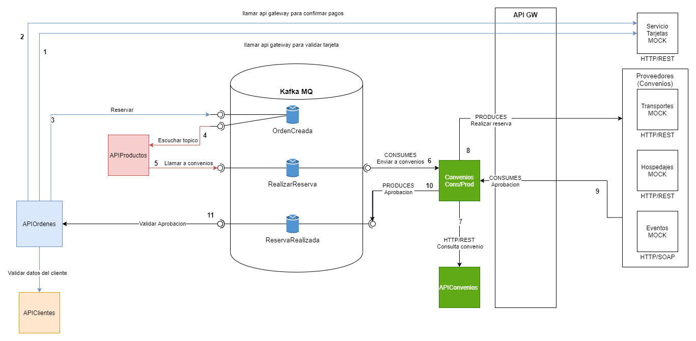

[API
Swagger](https://app.swaggerhub.com/apis/ujaveriana/sistema_pagos/1.0.0#free)

### API REST Clientes

[API Swagger
Dominio](https://app.swaggerhub.com/domains/optimus1006/ClientesDominio/1.0.0)

[API Swagger
Clientes](https://app.swaggerhub.com/apis/optimus1006/Clientes/1.0.0?loggedInWithGitHub=true)

### API REST Órdenes

[API Swagger
Dominio](https://app.swaggerhub.com/apis/ujaveriana/Orden/1.0.0)

[API Swagger
Órdenes](https://app.swaggerhub.com/apis/ujaveriana/Orden/1.0.0)

### API REST Productos

[API Swagger
Dominio](https://app.swaggerhub.com/domains/manuelgonzalezb/ProductosDominio/1.0.0)

[API Swagger
Productos](https://app.swaggerhub.com/apis/manuelgonzalezb/ProductosAPI/1.0.0#/)

### API REST Convenios

[API Swagger
Dominio](https://app.swaggerhub.com/domains/ivanalfonso88/DominioConvenios/1.0.0)

[API Swagger
Convenios](https://app.swaggerhub.com/apis/ivanalfonso88/Convenios/1.0.0#/)

### API REST Utilitarios

[API Swagger
Dominio](https://app.swaggerhub.com/domains/manuelgonzalezCOBIS/DominioUtilitarios/1.0.0)

[API Swagger
Utilitarios](https://app.swaggerhub.com/apis/manuelgonzalezb/Utilitarios/1.0.0)

## Propuesta de desarrollo

### Tiempo estimado de implementación

El desarrollo e implementación de esta arquitectura una vez aprobada es
de 2 meses

### Costos estimados 

Desarrollo e Implementación: $40.000.000 COP

Funcionamiento de la plataforma: valor mensual $11.272.759,18 -
Anualidad $135.273.110,21

**Detalle:** este puede incrementar o disminuir a razón de la conversión
monetaria o por aumento en la cantidad de transacciones

**Región** US East (Ohio)

| **Servicio**                                                   | **Mensual**       | **Anual**          | **Moneda** | **Descripción de configuración**                                                                                                                                                                                                                                                                           |
| -------------------------------------------------------------- | ----------------- | ------------------ | ---------- | ---------------------------------------------------------------------------------------------------------------------------------------------------------------------------------------------------------------------------------------------------------------------------------------------------------- |
| Amazon Aurora PostgreSQL-Compatible DB                         | 279,4             | 3352,8             | USD        | Quantity (1), Storage amount (20 GB), Amazon Aurora PostgreSQL Compatible DB instance type (db,r5,xlarge)                                                                                                                                                                                                  |
| Amazon EC2                                                     | 451,17            | 5414,04            | USD        | Operating system (Linux), Quantity (4), Storage for each EC2 instance (General Purpose SSD (gp2)), Storage amount (30 GB), Instance type (t3a,xlarge)                                                                                                                                                      |
| Amazon CloudWatch                                              | 36                | 43,68              | USD        |                                                                                                                                                                                                                                                                                                            |
| Amazon Elastic IP                                              | 43,8              | 525,6              | USD        | Number of EC2 instances (4), Number of EIPs per instance (4)                                                                                                                                                                                                                                               |
| Amazon Route 53                                                | 26                | 312                | USD        | Hosted Zones (2), Basic Checks Within AWS (100)                                                                                                                                                                                                                                                            |
| Amazon Virtual Private Cloud (VPC)                             | 146               | 1752               | USD        | Número de conexiones de Site-to-Site VPN (4)                                                                                                                                                                                                                                                               |
| AWS Web Application Firewall (WAF)                             | 716               | 8592               | USD        | Número de listas de control de acceso web (ACL web) utilizadas (50 por mes), Número de reglas agregadas por ACL web (20 por mes), Número de grupos de reglas por ACL web (20 por mes), Número de reglas dentro de cada grupo de reglas (20 por mes), Número de grupos de reglas administrados (20 por mes) |
| Elastic Load Balancing                                         | 602,25            | 7227               | USD        | Número de balanceadores de carga clásicos (1), Bytes procesados por CLB (100 GB por hora)                                                                                                                                                                                                                  |
| Amazon Simple Notification Service (SNS)                       | 21,6              | 259,2              | USD        | Data Transfer, Solicitudes (1 millones por mes)                                                                                                                                                                                                                                                            |
| CloudFront                                                     | 602,1             | 7225,2             | USD        | Certificados SSL personalizados:                                                                                                                                                                                                                                                                           |
| Servicio AWS Direct Connect (EE. UU. Este (Norte de Virginia)) | 241,56            | 2898,72            | USD        |                                                                                                                                                                                                                                                                                                            |
| **Subtotal servicios mensuales**                               | **3166,282**      | **37602,24**       | **USD**    |                                                                                                                                                                                                                                                                                                            |
|                                                                | **11.363.437,81** | **134.950.303,11** |            |                                                                                                                                                                                                                                                                                                            |
| Cognito                                                        |                   | 0,050              | USD        | Primeros 50 000 MAU                                                                                                                                                                                                                                                                                        |
| TOTAL                                                          |                   | 37.602,290         |            |                                                                                                                                                                                                                                                                                                            |
| **TRM**                                                        |                   | **3597,47**        |            |                                                                                                                                                                                                                                                                                                            |
| **Valor anual**                                                | **11.272.759,18** | **135.273.110,21** |            |                                                                                                                                                                                                                                                                                                            |

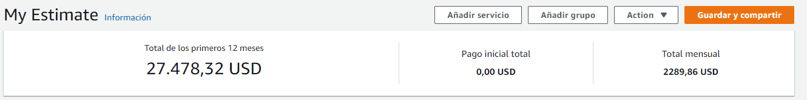

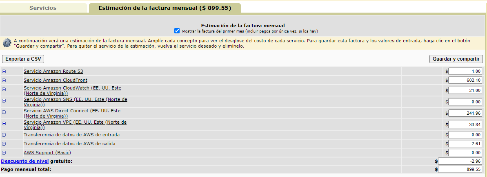

## Medición y resultados

### análisis con herramienta CloudWatch

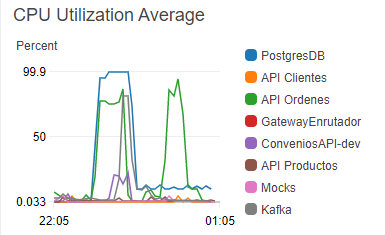

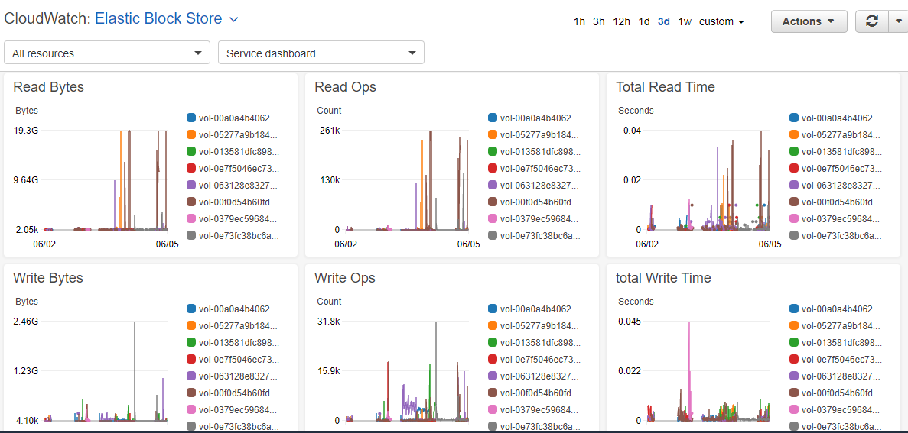

### Análisis con los datos Productos JMeter 

 

Se espera que el sitio atienda 10 millones de visitas mensuales, por
lo cual los servicios deberían estar optimizados para recibir un número
de peticiones equivalente al número de visitas.  

| **Peticiones** | **días** | **Tiempo(min)** |
| -------------- | -------- | --------------- |
| 10.000.000     | 30       | 43.200          |
| 231            |          | 1               |

  

De acuerdo con lo esperado por Toures Balon los servicios deben estar en
capacidad de atender 231 peticiones por minuto equivalentes a cerca de 4
peticiones por segundo.  

 

A continuación, se evidencian las pruebas de generadas para los
servicios del dominio de productos:  

 

## Prueba de rendimiento para una carga de 4 peticiones por segundo. 

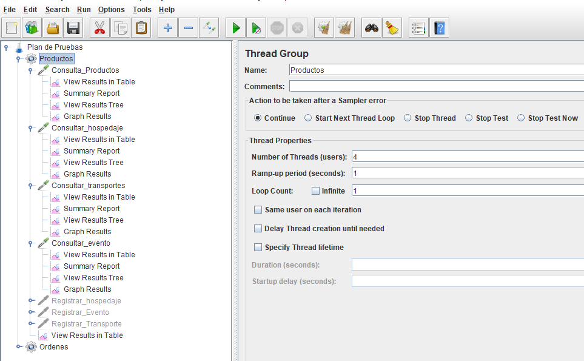En esta carga se logra evidenciar los tiempos de
respuesta acordes a lo requerido por toures balon.  

 

### Consulta de hospedajes 

Esta consulta se realiza por id del hotel   

El tiempo promedio de respuesta de este servicio es de 206 milisegundos
por petición. 

El throughput es de 4.1 transacciones por segundo. 

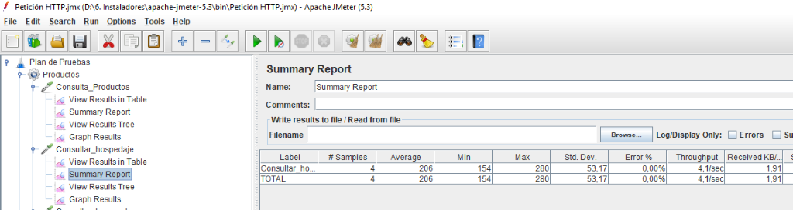 

### Consulta de transportes 

Esta consulta se realiza por id de la entidad de transporte 

El tiempo promedio de respuesta de este servicio es de 155 milisegundos
por petición. 

El throughput es de 4.6 transacciones por segundo. 

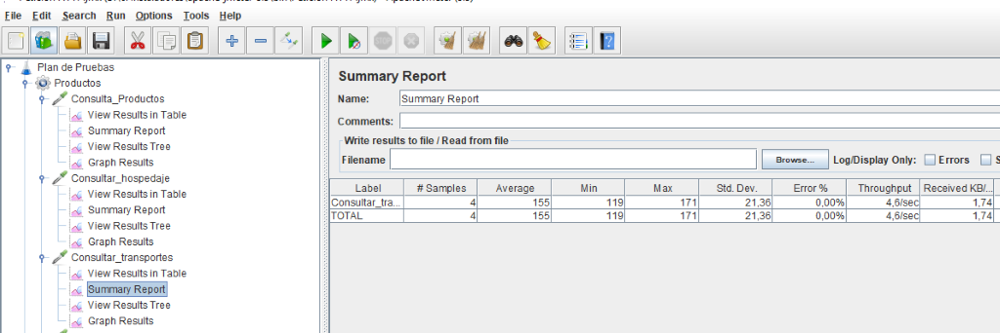 

### Consulta de eventos 

Esta consulta se realiza por id del evento 

El tiempo promedio de respuesta de este servicio es de 194 milisegundos
por petición. 

El throughput es de 4.4 transacciones por segundo

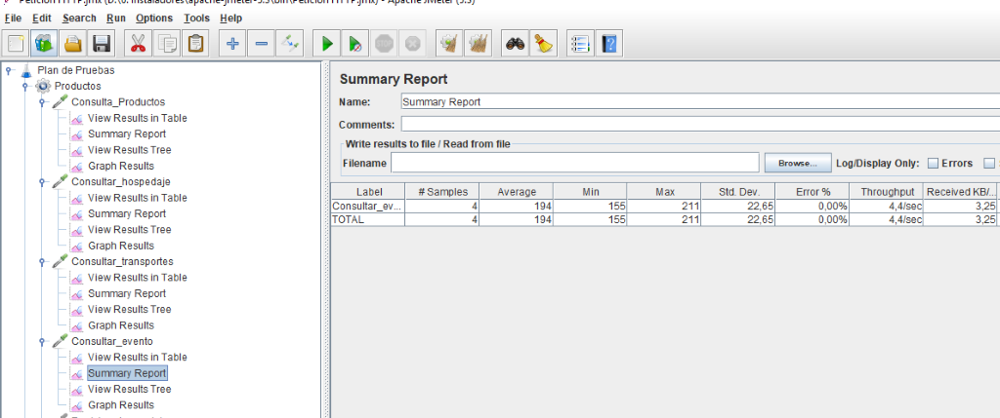

  

La siguiente prueba permite determinar el comportamiento del sistema en
una carga durante 60 segundos.

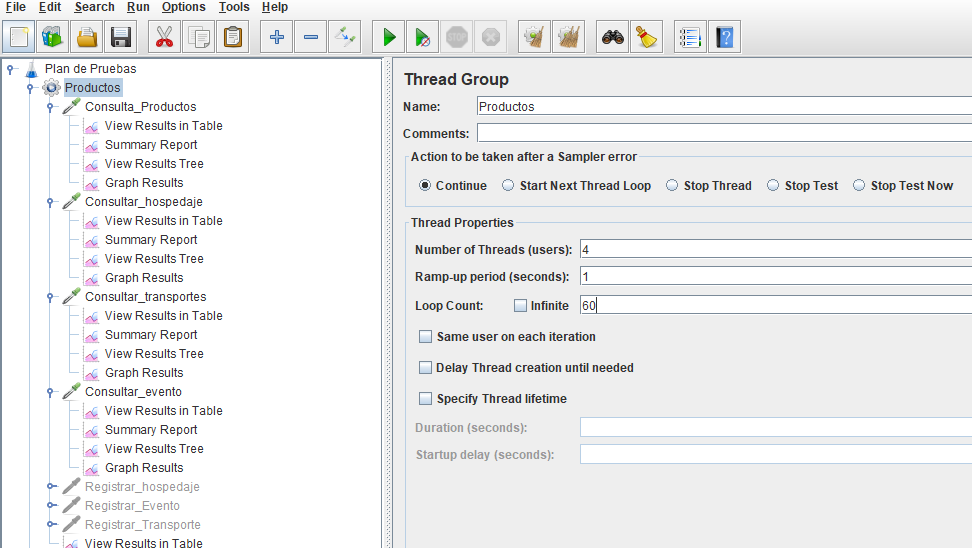

## Prueba de rendimiento para una carga de 4 peticiones por segundo durante una ejecución de 60 segundos.  

 

### Consulta de hospedajes 

Esta consulta se realiza por id del hotel   

El tiempo promedio de respuesta de este servicio es de 219 milisegundos
por petición 

El throughput es de 1.9 transacciones por segundo. 

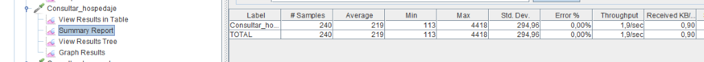 

### Consulta de transporte 

Esta consulta se realiza por id del transportador 

El tiempo promedio de respuesta de este servicio es de 164 milisegundos
por petición 

El throughput es de 1.9 transacciones por segundo. 

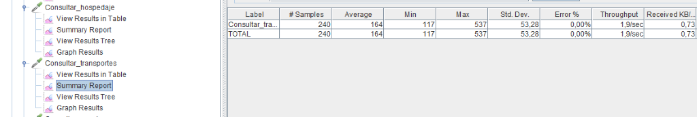

### Consulta de eventos 

Esta consulta se realiza por id del evento 

El tiempo promedio de respuesta de este servicio es de 336 milisegundos
por petición 

El throughput es de 1.9 transacciones por segundo. 

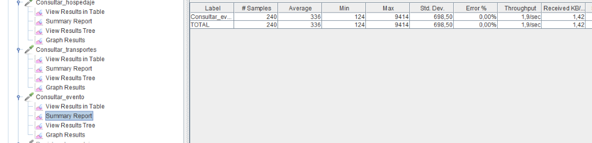 

En la siguiente prueba se realiza el ciclo completo del proceso de
compra (consulta de productos, consulta convenios, creación de orden y
compra de paquete).   

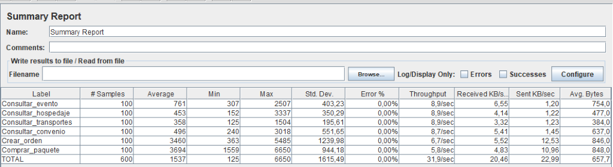
